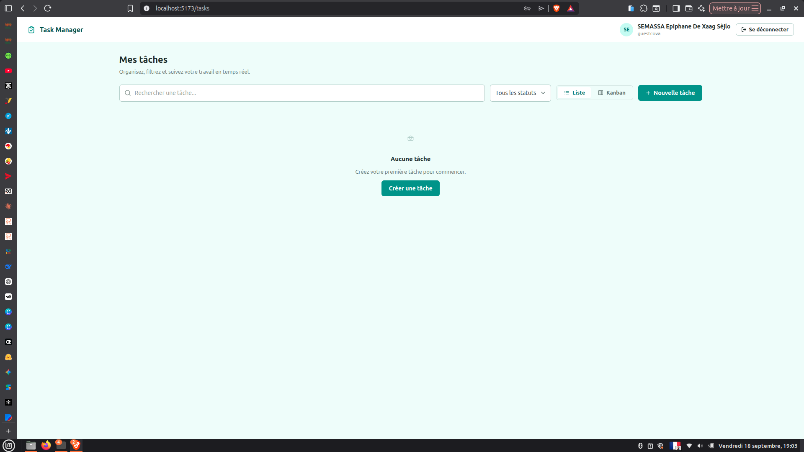
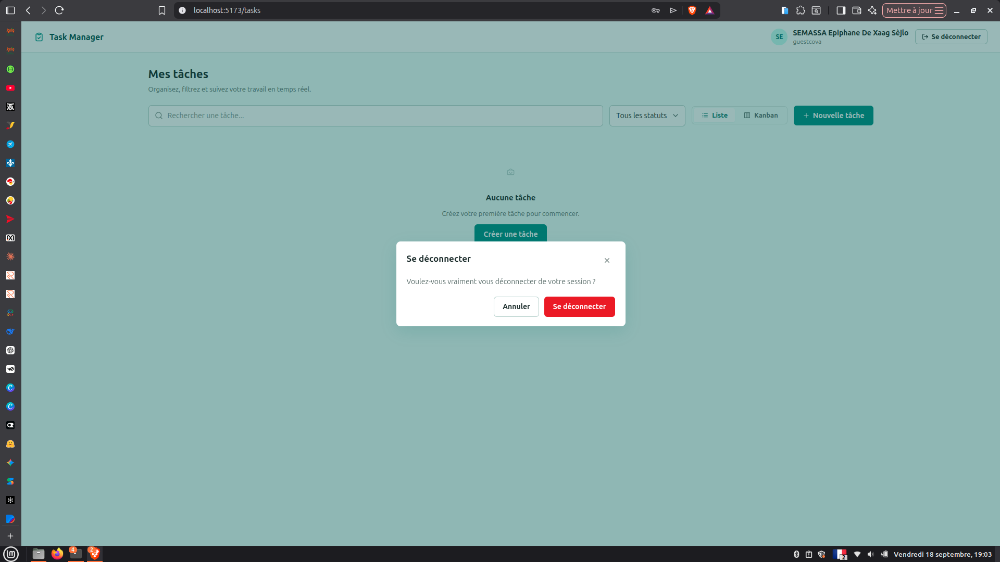
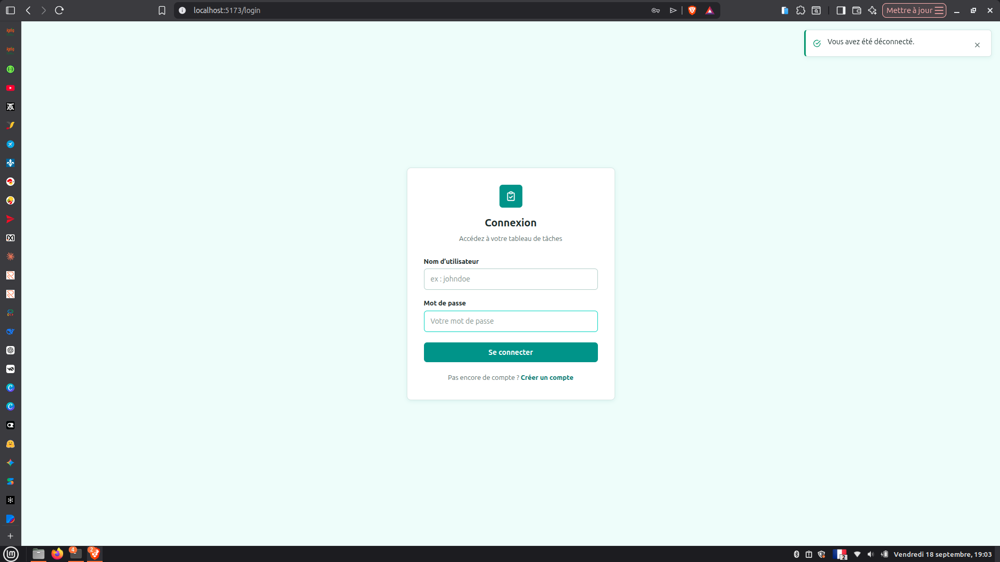
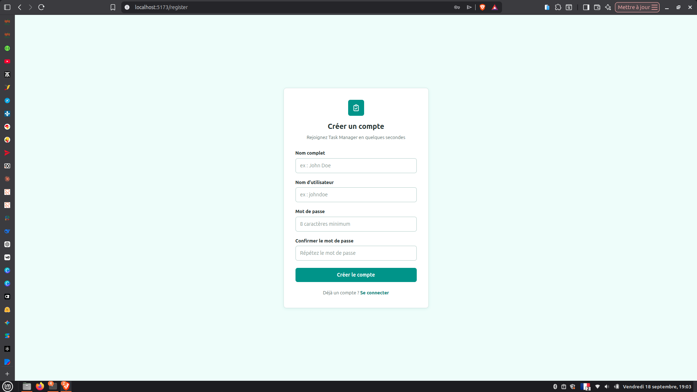
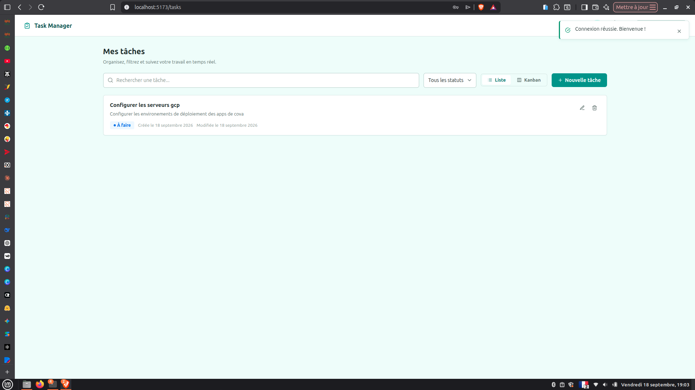
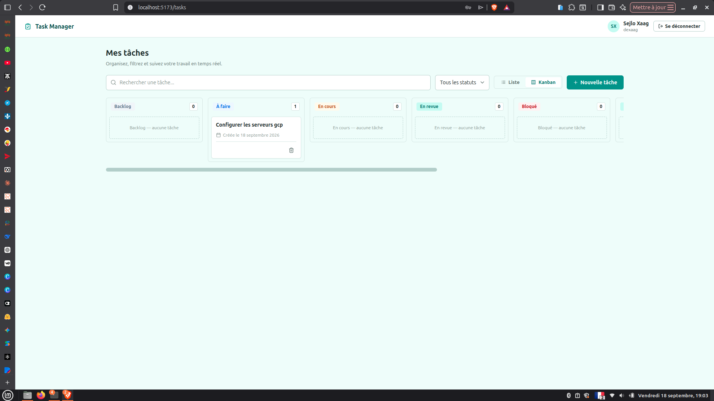
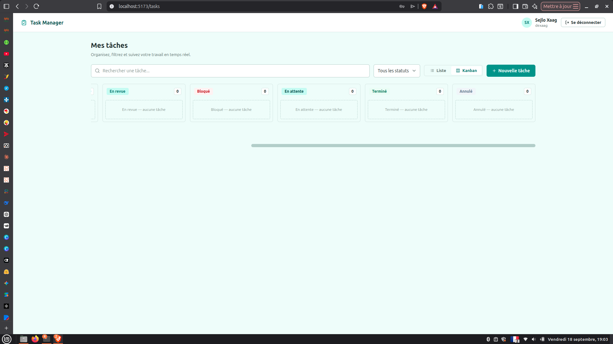
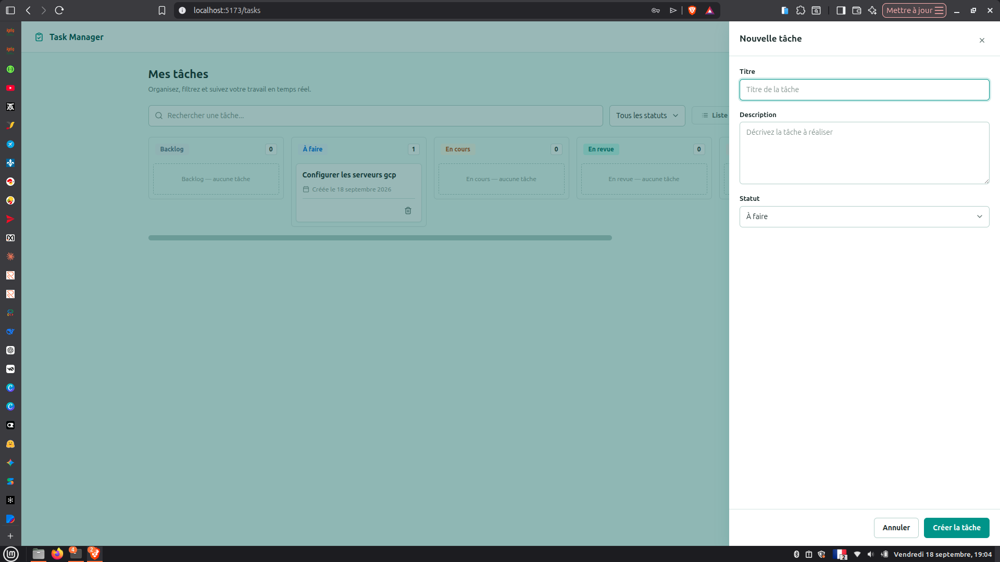
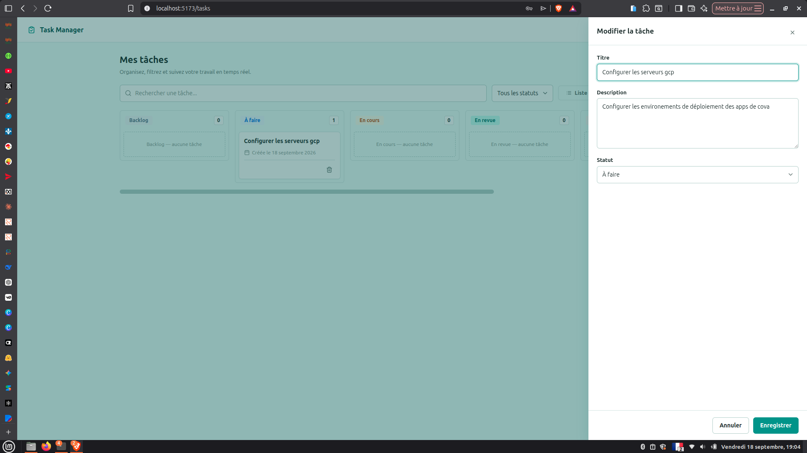
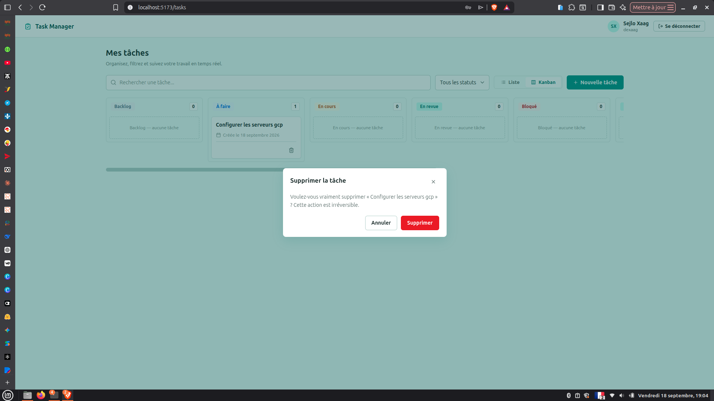

# Task Manager — Frontend

Application de gestion de tâches construite avec React, TypeScript et Vite. Consomme l'API REST du backend Spring Boot (`task-manager`).

## Stack technique

- React 19 + TypeScript
- Vite 8
- React Router v7
- React Hook Form + Zod (formulaires, validation)
- TanStack React Query v5 (data-fetching, cache, mutations)
- Axios (client HTTP, interceptors)
- SCSS (design system, thème teal light)
- Tailwind CSS (utilitaires ponctuels)
- Codegen automatique (`@hey-api/openapi-ts`) depuis la spec OpenAPI

## Prérequis

- Node.js >= 18
- npm >= 9
- Le backend `task-manager` démarré sur le port 7000

## Démarrage

```bash
# Installer les dépendances
npm install

# Configurer les variables d'environnement après la copie de l'exemple
cp .env.example .env

# Démarrer au préalable le backend sur le port 7000 (dans un autre terminal)

# Démarrer le frontend
npm run dev
```

Le frontend est accessible à l'adresse `http://localhost:5173`.

## Exécution avec Docker

Le projet est containerisé par un `Dockerfile` multi-étapes :

- Étape **build** : `node:24-alpine`, installation des dépendances (`npm ci`) puis build de production (`npm run build`).
- Étape **runtime** : `nginx:stable-alpine` sert les fichiers statiques. La configuration NGINX (`nginx.conf.template`) est montée en lecture seule via le `compose.yml` : fallback SPA vers `index.html`, cache des assets, `Cache-Control: no-store` sur l'HTML.

Le réseau `nw-cova-task-manager` est déclaré **`external: true`** dans le `compose.yml` : il est créé au préalable par le docker compose du backend (`task-manager`). S'il n'existe pas encore :

```bash
docker network create nw-cova-task-manager
```

Prérequis :

- Docker Engine + Docker Compose v2
- Le backend `task-manager` démarré (le port `7000` doit être publié sur l'hôte)

Étapes :

```bash
# 1. Démarrer le backend en Docker (crée le réseau nw-cova-task-manager) si ce n'était pas fait
cd ../task-manager
docker compose up --build -d

# 2. Builder et démarrer le frontend
cd ../task-manager-frontend
docker compose up --build -d
```

Le frontend est accessible à l'adresse `http://localhost:3000`.

Arrêt et logs :

```bash
docker compose down
docker compose logs -f frontend
```

## Variables d'environnement

| Variable | Description | Valeur par défaut |
|---|---|---|
| `VITE_API_BASE_URL` | URL racine du backend (prod) | `http://localhost:7000` |
| `VITE_OPENAPI_SPEC_URL` | URL de la spec OpenAPI (codegen) | `http://localhost:7000/v3/api-docs` |
| `VITE_PROXY_TARGET` | Cible du proxy Vite en développement | `http://localhost:7000` |

Le fichier `.env` n'est pas versionné (`.gitignore`). Seul `.env.example` l'est.

## Scripts npm

```bash
npm run dev          # Serveur de développement Vite
npm run build        # Build de production (tsc -b && vite build)
npm run preview      # Prévisualisation du build
npm run lint         # Analyse statique ESLint
npm run codegen      # Régénérer les appels API depuis le spec OpenAPI
```

## Architecture

```
src/
├── api/                    # SDK généré (intouché) + couche d'adaptation
│   ├── client.gen.ts       # Client axios généré
│   ├── sdk.gen.ts          # Fonctions d'appel API générées
│   ├── types.gen.ts        # Types générés
│   ├── client/             # Config interne du client (utils, body serializer, auth)
│   ├── core/               # Fonctions utilitaires du client (URL building, SSE)
│   ├── @tanstack/          # Hooks react-query générés
│   ├── interceptors/       # Intercepteurs axios (attache token, refresh 401)
│   └── endpoints/          # Wrapper typés corrigeant l'enveloppe API réelle
├── components/             # Composants UI génériques (sans logique data)
│   ├── Button, Input, Textarea, Select
│   ├── Badge, StatusBadge
│   ├── Modal, ConfirmDialog, Drawer
│   ├── ToastProvider + toast-context (système de notifications)
│   ├── Toggle, Spinner, EmptyState, IconButton
│   ├── ProtectedRoute, PublicOnlyRoute
│   └── Icon (SVG inline)
├── features/               # Modules fonctionnels (UI + hooks locaux)
│   ├── auth/               # AuthProvider, useAuth
│   │   ├── context/        # AuthContext séparé (réactivité sans re-render inutile)
│   │   └── hooks/
│   ├── layout/             # AppLayout (header, navigation, logout)
│   └── tasks/              # Fonctionnalité tâches
│       ├── components/     # TaskListView, KanbanView, KanbanColumn/Card, TaskDrawer, TaskForm
│       └── hooks/          # useTasks, useTaskMutations, useTaskFilters
├── hooks/                  # Hooks génériques (useDebouncedValue, useLocalStorage)
├── lib/                    # Utilitaires (token-storage, api-error extraction, format dates)
├── models/                 # Modèles de domaine (Task, TaskStatus, User)
├── dtos/                   # Types de payload API (auth, tasks)
├── types/                  # Types partagés (ApiEnvelope<T>)
├── pages/                  # Pages de routage (Login, Register, Tasks, NotFound)
├── styles/                 # Design system SCSS
│   ├── _variables.scss     # Tokens teal, couleurs, radii, ombres
│   ├── _mixins.scss        # Media queries, focus-ring, truncate
│   ├── _base.scss          # Reset global
│   ├── components/         # Styles par composant
│   ├── features/           # Styles par fonctionnalité
│   └── pages/              # Styles par page
├── App.tsx                 # Routes React Router
├── main.tsx                # Montage, config client, interceptors, providers
└── index.css               # Entry CSS (tailwindcss + import SCSS)
```

## Choix techniques

- **SPA** : React 19 + TypeScript + Vite — aucune logique côté serveur, le frontend consomme uniquement l'API REST.
- **Typage de bout en bout** : SDK généré automatiquement par `@hey-api/openapi-ts` depuis la spec OpenAPI du backend (jamais édité à la main). Une couche `api/endpoints/` déconditionne l'enveloppe API `{success, message, code, data}` et normalise les erreurs en messages lisibles pour les toasts.
- **État serveur avec TanStack Query** : toute la donnée distante passe par react-query (mutations optimistes, invalidation, rollback en cas d'échec). La liste des tâches **n'est jamais mise en cache** (`staleTime: 0`, `refetchOnMount: 'always'`, `gcTime: 0`) et le cache est vidé au login/logout pour ne jamais exposer les tâches d'un utilisateur précédent.
- **Authentification JWT** : tokens access/refresh stockés en `localStorage`, intercepteur axios posant le header `Authorization: Bearer`, refresh automatique partagé sur 401, déconnexion propre côté API. Un unique refresh parallèle si plusieurs 401 surviennent simultanément.
- **Formulaires** : React Hook Form + Zod (validation déclarative, erreurs typées et affichables dans l'UI).
- **Drag & drop** : API HTML5 native, chaque déplacement de carte déclenche une mutation optimiste vers l'API.

## Flux d'authentification

1. **Inscription** (`/register`) : formulaire avec validation zod → `POST /api/auth/register` → retour à `/login` avec toast de succès.
2. **Connexion** (`/login`) : formulaire → `POST /api/auth/login` → récupère `{token, refreshToken, expiryToken}` → stockage en `localStorage` → `GET /api/auth/user-info` → redirection `/tasks`.
3. **Token** : le token d'accès est envoyé via le header `Authorization: Bearer <token>` sur chaque requête protégée (intercepteur axios).
4. **Refresh automatique** : si une requête retourne 401 et qu'un refresh token est présent, le frontend appelle `POST /api/auth/refresh-token` (body `{token: <refreshToken>}`), stocke les nouveaux tokens, puis relance la requête échouée. Un seul refresh partagé parallèlement si plusieurs 401 surviennent simultanément.
5. **Déconnexion** (`/tasks`, bouton header) → popup de confirmation → `POST /api/auth/logout` (body `{token: <refreshToken>}`) → nettoyage localStorage → redirection `/login`.

## Enveloppe API

Toutes les réponses backend sont enveloppées dans :

```json
{
  "success": true,
  "message": "Message",
  "code": 200,
  "data": { ... }
}
```

La couche `api/endpoints/` déconditionne cette enveloppe (`response.data.data`) et normalise les erreurs en messages lisibles pour les toasts. Le SDK généré (`api/sdk.gen.ts`) n'est jamais utilisé directement par les composants.

## Thème

Thème teal light personnalisé via des variables CSS (`:root` dans `_variables.scss`). Les couleurs principales :

- Primaire : `#0d9488` (teal)
- Fond : `#f0fdfa`
- Surface : `#ffffff`
- Texte : `#1d2b2a`
- Border-radius maximum : 8px
- Aucun dégradé

## Drag & Drop (Kanban)

Le drag & drop utilise l'API HTML5 native (`draggable`, `onDragStart`, `onDragOver`, `onDrop`). Sur les appareils tactiles, le changement de statut s'effectue via le drawer d'édition (cliquez sur le titre d'une tâche).

## Codegen (OpenAPI)

Les fichiers `src/api/*.gen.ts`, `src/api/client/`, `src/api/core/` et `src/api/@tanstack/` sont générés automatiquement par `@hey-api/openapi-ts`. Ne pas les modifier manuellement. 
Pour régénérer :

```bash
# Le backend doit être démarré avec le spec OpenAPI disponible
npm run codegen
```

## Captures d'écran

Interface de l'application (dossier `screenshots/`) :

| | |
|---|---|
|  |  |
|  |  |
|  |  |
|  |  |
|  |  |
